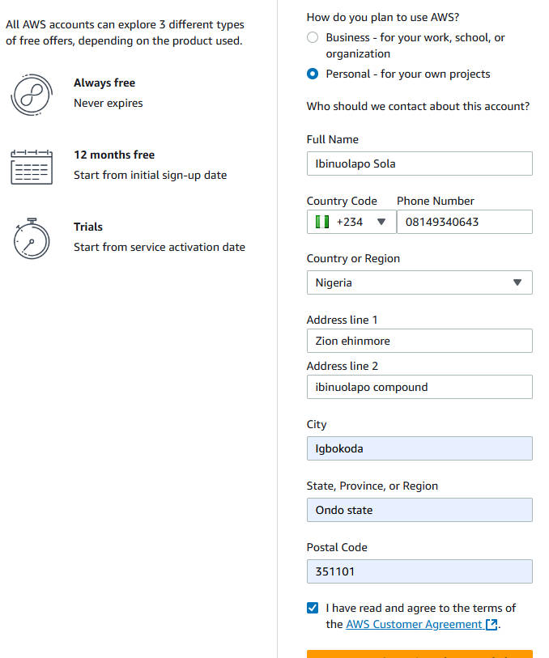
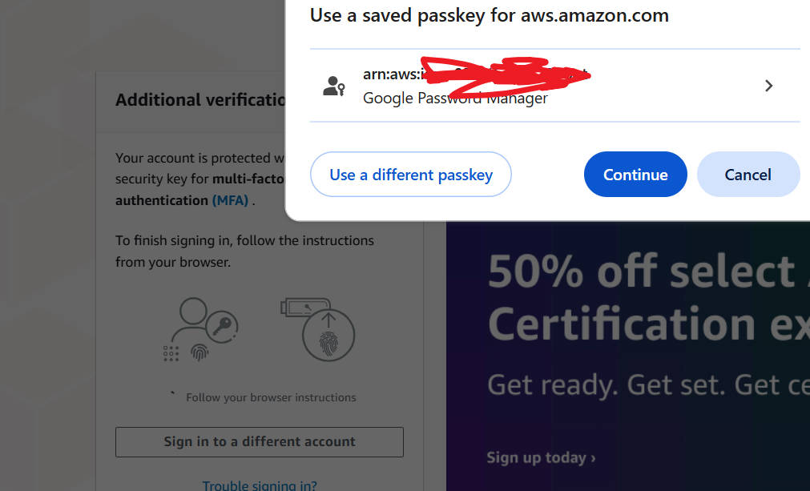

# **AWS Account Crreation project**

>**Cloud Computing.**

_The cloud is like a giant dogital space where storage, data and, files are kept vritually. instead of you tpo have them physically yiou can store it in a cloud._

> **What is AWs Cloud?**

_There are many cloud providers like Azure, google cloud platform, and IBM cloud, each offering a range of services for business and individual_
- _Amazon web services known as AWS is one of the leading cloud provider._
- _they sold part of the physical server to people onlone_
- _For example if you are starting a new business, and you need a computer , some memory(RAM), Storage space like Hard disk, and fsst processor(CPU) to run your computer, you can buy the particular size_
- _The less you use the less you pay_

>## **Setting Up your AWS Account**

**_Open and create AWS Account_**

_Enter the valid email address and name_

_enter the security code_

_enter verification code sent to email_

_Create password for the account_

_Contact information_

_Entering Card details_

_Confirming my Identity_

_Entering the code_

_confirm it_

_After puting the payment detils it bring me to sign up. I receive OTp and other necessary information_

_Starting with the Bascic support_ free option is recommended_
_I choose free tier and i continue_

_And My amazon web services account has been created successfully_

**_Sign in into Managemen Console_**
_To sign into the Aws accoun t created_

_Usin Root user to sign in into the AWS Account_

_i created passket immediately for login in_

**_AWS managemet Console_**
_After completing the setup process, i now access the AWS management console using new AWs account credentials_

_I have successfully logged in in to my amazon web services account_

## **_Exploring AWS managemet Console_** 
_After log in to management console, i navigate EC2 virtual cloud service which is one of the purpose of the cloud services_

_Instances where resources are being managed and creating a cloud services_

**This is all concerning Aws account where i navigate the resources**
