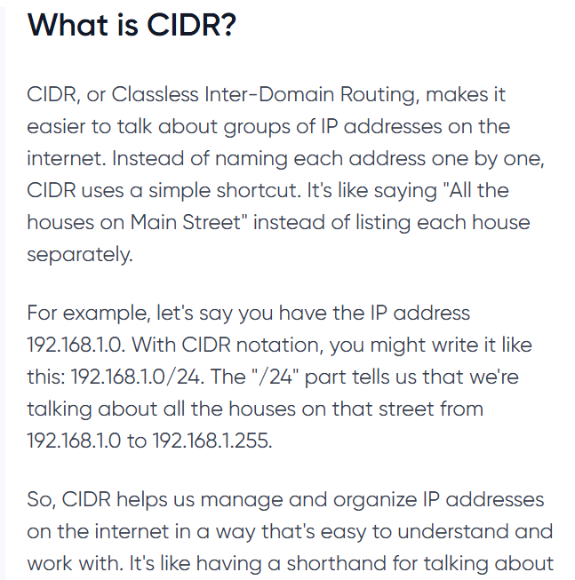
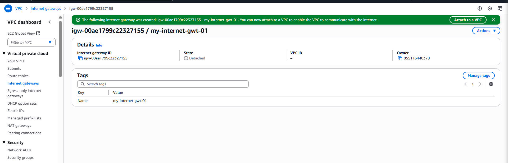
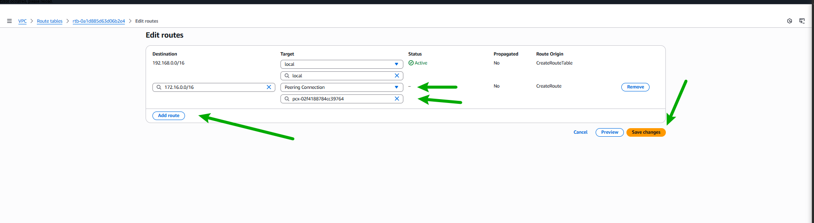

# **Network mastry with AWS VPC mini project**

>**This mini project is to explore the core concept of amazon (AWS), focusing specifically on virtual private Cloud(VPCs).**

>__This project is to document the understanding of VPC, from fundamental components of VPC infrastructure, including subneta, gateways, and routing tables.__

**What is VPC, Subnets, Internet Gateway, and NAT Gateway?**

**VPC**
_VPC is all about creating a private room in the cloud just so that computer can comminucate securely_ 
_In the VPC we have different sections called subnets, for different parts of the business_

_Internet Gateway let the VPc communicate securely_

_NAT Gatewway is a secret agent between computer and the internet. NAT gateway translate the computer's message and send it out without know who sent the message from office_

_2^(32 - 24) - 2

=2^8 - 2

=256−2

=254

> # **Part-1**
## __Navigate to the search bar__
_Enter `VPC` upon locating the relevant result, proceed to click on it, directing you to the virtual private cloud (VPC) page_

__navigate to the `Create VPC` options__

__Select `VPC only` option, specify the `IPv4 CIDR block__

__VPC created__

> # **Part-2**
## __Configuring Subnet within the VPC__
_navigate to the subnet at the left of sidebar_

__Create Subnet__

_Select the ID of the VPC that i cretaed in the previous step (part 1)_

_Enter the subnet name, and specify IPv4 CIDR for the subnet_
_Choose the Availability zone_

_Repeat the same steps for `second subnet`, just make sure is private and public eg `10.0.6.0/24` and `10.0.7.0/24`_

__The subnet is created__

> # **Part-3**
## __Creating internet Gateway__
_Navigate to the `Internet Gateway` at the left of sidebar_
__Proceed to `create internet gateway` button.
 

__Specify the name of the internet gateway__
 

__Internet Gateway is createds__
 

_Now you will see it is  currently dettached. meaning it is not associated with any VPC_
_Now, let enable it internet to connectivity_

__Now Attach it to the VPC__

> # **Part-4**
## __Enabling internet connectivity with the internet gateway__
_Proceed to the `Route tables` option located on the left sidebar_
 

_Click on the `create route table` button. Enter the name of the route table and select the VPC i previously created_
_click on the `create route table` button to proceed_
 

_Click on `Subnet associations`, followed by edit associations to associate the subnet with the riute table_

__Click on public subnet and save associate__

__I Navigated to `Routes` and then click on `Edit routes`__

__Click on add route__
_I Select `Destination` as `0.0.0.0/0`, indicating that ecery IPv4 address can access this subnet_
_I chose `internet gateway` in the target field_

_the route table now has now been configured to route traffic to the internet gateway_

> # **Part-5**
## __Enabling Outbound internet Access through NAT gateway, (by attaching NAT Gateway to the subnet and attaching the route table.)__
_navigate to the `NAT Gateways` section, then click on `Create NAT Gateway`._
 

_Then name your NAT gateway_

_Now, choose the private subnet because of annonymous message for security purpose_

_press Create button to create the natgateway_

_Nat gateway created successfully_

_Select the NAT gateway, naviagte to the "Details tab". locate the subnet ID and click on it_

_In the subnet page, navigate to the `"Route Table"` section, then click `route ID`_

_proceed to the `Routes` section, then click on `edit routes`_

__Then Click on `Add routes`__

_Select  `Destination` as `0.0.0.0/0`_ then target field, choose `NAT Gateway`, Then select the NAT gateway you created. Finally, save the the change

_On the subnet associate dection, `click` on `edit` subnet associate._

_Choose the private and clikc on `save associates`_

_the subnet has been cretatd successfully_

>**Different between Internet Gateway and NAT Gateway**

* `The Internet gateway` is a subnet that allow inflow and outflow of resouces like EC2 instaces. 
* `NAT gateway` is a oneway traffic that only deal with inflow but no outflow because of its sensitivity. the subnet connect to the internet but it does not allow incoming traffic.
* 

# **VPC peering Connetion**
_vpc peering is like peering two virtual office in the cloud so that they can talk to each other directly without going through through a middleman_

* By default, EC2 instance in different VPCs cannt communicate with each other.
* To enable the communication between EC2 instances in differnt VPCa, you can set up `peering`, VPN connections, or AWS Direct Connect.

# **VPC peering Connetion**
We need to do peering if we want different part of our Cloud network (VPCs) to walk with each other smootjly. for example, you have one VPC  for development and other for Marketing team, and you want them to share data securely. that is where VPC peering comes in handy. it lets these VPCs to communicate directly, making things easier for everyone.

>**Key point**

> # **Part-6**
## __Practical part of it by begin of creating two VPC either in the same region or different region__

__The both peering VPC created sucessfully__

- _Navigate to the `peering connection sidebar` option in the left_
- _Upon clicking, you'll be directed to the VPC peering page._
- _From there, proceed to click on the `Creating peering Connection` button

- _Now, provide a name for the VPC peering connection_
- _Select the requester VPC_
- _Choose the account `MY account` since the VPCs are in our own AWS account_
- _ ensure to use the same region, `This region(eu-north-1),` as the VPCs created in the same region_
- _Next, accepter VPC_
- proceed by clicking on the`Create peering Connection` button

- __Then you will see__

- __In the peering Connection page, locate the `Actions` option on the right side.__

- _Click on it, then select `Accept Request`_

_Click on `Accept request`_

_Click on Main route tale ID of the accepter VPC_

- _Choose the route table._
- _Then navigate to the `Routes`_ section.
- Click on `Edit route`

- _Click on add route_

_Input request VPC IPv$ CIDR. in case - 192.168.0.0/16, copy it and paste it in the `Destination` field when adding a route_

in the target, choose VPC peering and then choose the peerin g connection you have created. Click on save changes._

_successfully created_

- _Now, copy IPv4 CIDR of the accepter VPC. in this case- 172.16.0.0/16_

_Now, Click on Main route table ID of the requester VPC
_

_Choose the route table, then navigate to the `routes` section. Click on `Edit route`_

_Click on add route._

Created successfully

__The rescouces in the accepter VPC can connect to resources in requester VPC, and vice versa__

## **point**
_VPC peering allows direct communication between two VPCs using private IP addresses. Region compatibility: VPC peering can be set up between VPCs in thre same AWS or different regions and the same AWS account or different AWS account._

> # **__VPC endpoint__**

**The problem**
_if you are trying to backup data from EC2 instances to S# bucket, it will usually pass internet and if the information are sensitive which hacker can take advantage of, so is risk._

_To avoid this risk, we can use something called VPC endpoints. this endpoint make a private connection between the VPC and S3, so the data does not have to go over the internet. so, this way it  is secured from the hacker_

**This is all This is all about setting up the VPC cloud infrastructure and configurung network component**
