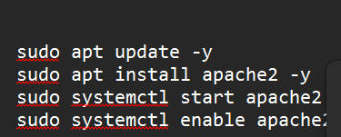
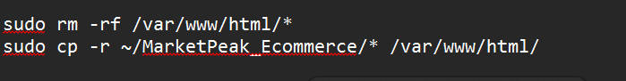
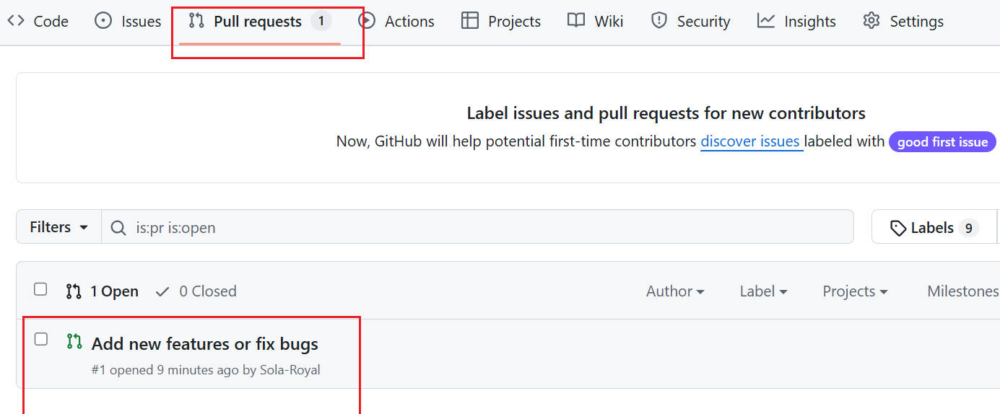

# **Capstone Project: E-Commerce platform deployment with Git, linux,and AWS**

>**this capstone is a will be use to develp an e-commerce website Named `MarketPeak`. I will use git version control on it, develop the platform on a linux environment and VS code, and deploy it to AWS ec2 instance**

----
># **1. Implement version control with Git**

> **User inpput for Number** 
_Creating a directory named `marketPeak_Ecommerce` and initilize it with fit repository_ 

>## **Obtain and prepare the E-Commerce Website Template** 
_This is the folder template of the website snd is named `MarketPeak`_

_The website code and the home page`index.html`_

>## **Stage and Commit the template Git** 
_Adding a website file to the git repository and commit it to the github_

_Push the code to the remote repository i created named `marketpeak_Ecommerce`_
_This command `git push -u origin main` pyshes my commit from local to remoy=te repository in order to store the project in the cloud_

># **2. AWS Deployment** 
_To deploy `MarketPeak_Ecommerce` platform, i need to setup an Amazon EC2 instance_

> **Clone the repository on the Linux server** 
_before deploying the website I have to clone github to my AWS EC2 instance using `ssh`_  

**_SSH Method_**
_Generate ssh keygen using `ssh-keygen`_

_Using `cat /home/ubuntu/.ssh/id_rsa.pub` to Display and copy the public key. the cloned into our EC2_

> **Install a web Server on EC2** 
_`Apache Http server` is widely used server that HTML file and content over the internent_  

> **Configure apace for Website** 
_prepare the web directory_

_`sudo systemctl reload apache2` to reload the service after configuration_

> **Access Website from Browser** 
_With `apache` configuration and website file in place, MarketPeak Ecommerce platform is live on the Internet_

># **3. Continuous Integration and Deployment Workflow** 
_To ensure a smooth workflow for development, testing, and deploying your e-commerce platform_

> **Developing new Features and fixes** 
_Create a Development branch_

**_Version Control with Git_** 
_`add .` used to stage the the change in new branch. `git commit -m "Add new features or fix bugs"` for commit changes that secure save in the Git repository. `git push origin development` to to enable collaboration and version tracking_

**_Pull request and merging to the Main branch_** 
_pull request is created and from the branch `Development branch`. _

_Review and merge the PR_

**_`Git checkout main` bring it to main branch and use `git merge development` to merge the branch update to main. then use this `git push origin main` to pushit to the github_**

## **_Deploying updates to the producton server_** 
_Pull the request `git pull origin main`. ssh into the AWS EC2 instance where production website is hosted._

## **_Chanllenges facing_** 

_I encoutered challenges while i was trying to merge the branch when it has not move to main branch.  _The second chanllenges was when i did not pull the request change before push the local server__

**This workflow emphasizes best practices in software development and deployment, including branch management, code review through pull request**